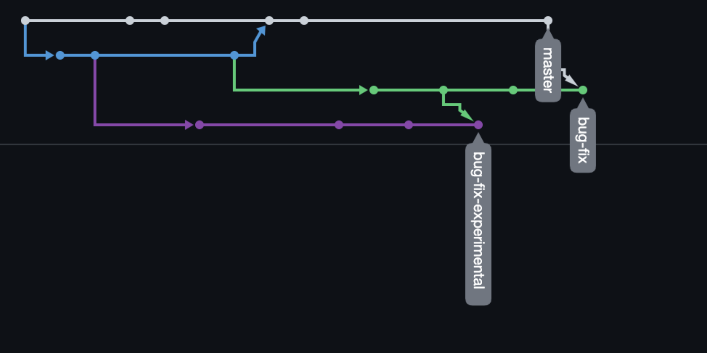

# A small git exercise on branching

To note, that in both merge conflicts, I opted to keep the changes from the current and incoming branch changes.

### Credits

Thanks to Dr Keith L Mannock at the University of BBK for the basis of this exercise.
